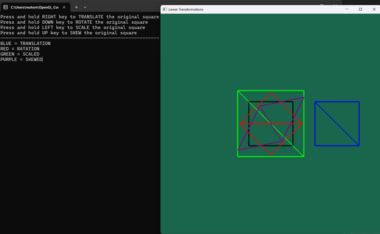

### Linear Transformations: Module 4 - Transformations

### 📄 Description
This program demonstrates linear transformations on a 2D square using OpenGL. It renders translated, rotated, scaled, and skewed versions of the original square.

### 🛠️ Version
- `g++` 13.2.0  
- `gcc` 11.4.0

### ✅ Requirements
- [GLAD](https://glad.dav1d.de/)
- [GLFW](https://www.glfw.org/) 3.3 or above
- [GLM](https://github.com/g-truc/glm)

### 🎮 Controls
- Use the **arrow keys** (`UP`, `DOWN`, `LEFT`, `RIGHT`) to apply different translations to the square.

### 🔍 Note
- Additional transformation instructions will appear in the **terminal** after you run the program.
